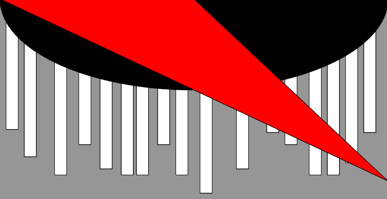
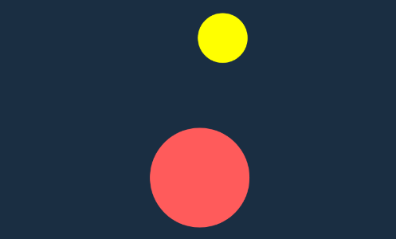

# CART 253 Course Repository :guitar:

John Hanna

> 

## Description

This website serves as a working archive of all the prototypes I have created in this class. It also includes a link to a reflective journal, where I document my thoughts and feelings during or post the production of each prototype, as well as links to other platforms where I maintain an online presence. All that said, I sincerely hope this becomes a repository of ideas that I can return to for further creative development.

## Prototypes

### Tron Light Cycle
- [View Online](https://pulchtritude.github.io/cart253/topics/instructions/light-cycle-prototype/index.html)
- [Code](https://github.com/Pulchtritude/cart253/blob/main/topics/instructions/light-cycle-prototype/js/script.js)
> 

### Fear of the Dark
- [View Online](https://pulchtritude.github.io/cart253/topics/instructions/fear-of-the-dark-prototype/index.html)
- [Code](https://github.com/Pulchtritude/cart253/blob/main/topics/instructions/fear-of-the-dark-prototype/js/script.js)
> 

### Pharmakon Sign
- [View Online](https://pulchtritude.github.io/cart253/topics/instructions/pharmakon-sign-prototype/index.html)
- [Code](https://github.com/Pulchtritude/cart253/blob/main/topics/instructions/pharmakon-sign-prototype/js/script.js)
> 

## Challenges

### Landscape
- [View Online](https://pulchtritude.github.io/cart253/topics/instructions/instructions-challenge/index.html)
- [Code](https://github.com/Pulchtritude/cart253/blob/main/topics/instructions/instructions-challenge/js/script.js)
> 

### Ragebaiting Mr. Furious
- [View Online](https://hikki0001.github.io/cart253-testing/Challenge-Variables/index.html)
- [Code](https://github.com/Hikki0001/cart253-testing/tree/main/Challenge-Variables)
> 

## Links

1. [Reflective Journal](journal.md)
2. [Itch.io Page](https://f0lk3n.itch.io/)

## Screenshot(s)

This bit should have some images of the program running so that the reader has a sense of what it looks like. 

## Attribution

This bit will attribute any code, assets or other elements used taken from other sources.

> - The banner above image is a work of digital art made by me!

## License

This bit will include relevant licenses that apply my your work.