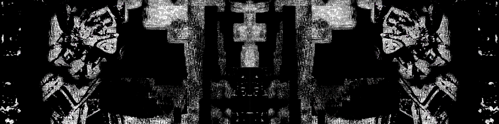

# CART 253 Course Repo Website 

John Hanna

[View this project online](URL_FOR_THE_RUNNING_PROJECT)

## Description

The purpose of this website is to have a working archive that holds all of my prototypes made in this class.

> This course website for class code CART 253 is a working archive that holds all of John Hanna's prototypes made in this class.

> The experience is controlled via the mouse, with left click selecting a clown and bringing up a menu of options such as "slip of banana peel" or "get into impossible capacious clown-car."

> The project is meant to give the user a sense of what it would be the mayor of a town of clowns, eventually getting the sense that clowns are not taking their civic duties seriously.

## Links

1. [Reflective Journal](journal.md)
2. [Itch.io Page](https://f0lk3n.itch.io/)

## Screenshot(s)

This bit should have some images of the program running so that the reader has a sense of what it looks like. For example:

> 

## Attribution

This bit should attribute any code, assets or other elements used taken from other sources. For example:

> - This project uses [p5.js](https://p5js.org).
> - The clown image is a capture of the clown from the Apple emoji character set.
> - The barking sound effect is "single dog bark 1" by crazymonke9 from freesound.org: https://freesound.org/people/crazymonke9/sounds/418107/

## License

This bit should include the license you want to apply to your work. For example:

> This project is licensed under a Creative Commons Attribution ([CC BY 4.0](https://creativecommons.org/licenses/by/4.0/deed.en)) license with the exception of libraries and other components with their own licenses.